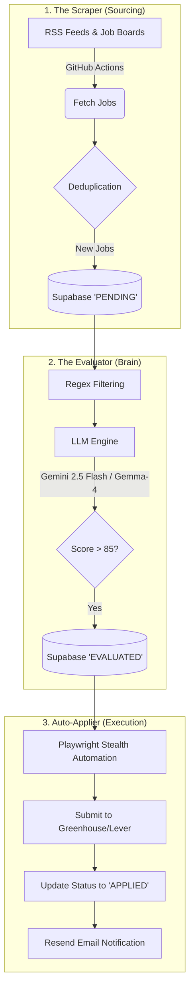

<div align="center">
  <h1>🚀 Zero-Cost Job Hunt Agent</h1>
  <p><strong>A fully autonomous, zero-cost AI agent that sources job postings, evaluates candidate fit using an LLM, and automatically submits applications.</strong></p>

  <!-- Screenshot Placeholder -->
  

  <!-- Badges -->
  <br />
  <a href="https://github.com/freakyjones/job-hunt-agent/actions"></a>
  <a href="https://nextjs.org/"></a>
  <a href="https://supabase.com/"></a>
  <a href="https://playwright.dev/"></a>
  
  
</div>

<hr />

## 📖 Overview

The **Zero-Cost Job Hunt Agent** is a sophisticated, open-source automation tool built on the Google Antigravity SDK. It acts as an autonomous personal recruiter and applicant. By leveraging RSS feeds, company job boards, Google's Gemini LLMs, and Playwright automation, this agent runs entirely in the background to streamline the tedious job application process—all while keeping infrastructure costs exactly at **$0.00**.

## ✨ Core Features & Guardrails

- **Zero-Cost Infrastructure:** Runs on Supabase Free Tier, Google AI Studio Free Tier (15 RPM max), and GitHub Actions.
- **Dynamic Cover Letters:** Cover letters are intelligently generated and attached _only_ if the application form explicitly marks them as a required field.
- **ATS Whitelisting & Blacklisting:** The Auto-Applier safely targets **Greenhouse** and **Lever**. Complex/Legacy systems like **Workday and Taleo are strictly blacklisted/flagged** for manual review.
- **Human-in-the-Loop Safety:** Explicit human approval (via email link) is required for the first 10 auto-applications to prevent AI hallucinations during form-filling.
- **Secure Resume Handling:** Master resumes are stored securely via Supabase Storage (`base_resumes`) with strict Row Level Security (RLS) policies.

## 🏗 Architecture & Workflows

The system is broken down into three resilient workflows operating within a Next.js / Supabase monorepo.

### Monorepo Structure

```text
job-hunt-agent/
├── apps/
│   ├── dashboard/   # Next.js App Router UI (User facing)
│   └── agent/       # Playwright / LLM background workers
├── packages/
│   ├── types/       # Shared TS definitions
│   └── eslint/      # Centralized ESLint & TS configs
└── supabase/        # Database migrations & seed data
```

### Flow Diagram



## 📖 Usage Guide

Once installed, follow these steps to put the agent to work:

1. **Upload your Master Resume:** Log into the Next.js dashboard, navigate to Profile, and upload your master PDF resume. This gets securely saved into the `base_resumes` Supabase bucket.
2. **Review Pending Jobs:** The scraper runs every 4 hours. You can view scraped jobs on the "Pending" tab of the dashboard.
3. **Human-in-the-Loop Approval:** When a job scores > 85, you will receive an email via Resend asking for permission to apply. Click "Approve" in the email. After 10 successful manual approvals, the agent will remove the training wheels and auto-apply in the background.

## 🛠 Prerequisites

Before getting started, ensure you have the following installed:

- [Node.js](https://nodejs.org/) (v18+)
- [pnpm](https://pnpm.io/) (v9.0.0+)
- [Supabase CLI](https://supabase.com/docs/guides/cli)
- Git & GitHub Account

## 🚀 Local Setup & Installation

**1. Clone the repository:**

```bash
git clone https://github.com/freakyjones/job-hunt-agent.git
cd job-hunt-agent
```

**2. Install dependencies:**

```bash
# This project strictly uses pnpm
pnpm install
```

**3. Configure Environment Variables:**
Copy the `.env.example` to `.env` in the root directory.

```bash
cp .env.example .env
```

Fill out all secrets. **Never commit your `.env` file.**

| Variable                        | Description                                       |
| ------------------------------- | ------------------------------------------------- |
| `GEMINI_API_KEY`                | Your Google AI Studio API key                     |
| `RESEND_API_KEY`                | Your Resend API key for email notifications       |
| `EMAIL_TO`                      | The destination email for human approvals         |
| `SUPABASE_URL`                  | Local emulator: `http://127.0.0.1:54321`          |
| `SUPABASE_SERVICE_ROLE_KEY`     | Secret service role key                           |
| `NEXT_PUBLIC_SUPABASE_URL`      | Public frontend URL (matches backend URL locally) |
| `NEXT_PUBLIC_SUPABASE_ANON_KEY` | Public anonymous key for Supabase frontend        |

**4. Start the Local Supabase Emulator:**
Make sure Docker is running on your machine.

```bash
supabase start
```

**5. Start the Development Server:**

```bash
pnpm run dev
```

The Next.js dashboard will be available at `http://localhost:3000`.

## 🧪 Testing & Development

- **Unit & UI Tests:** Run Vitest tests configured with `jsdom`:
  ```bash
  pnpm run test:ui
  ```
- **End-to-End Tests (Playwright):**
  Playwright tests must be run against a production build sequentially.
  ```bash
  pnpm run build
  pnpm run test:e2e
  ```
  _Note on DX:_ Playwright runs in `headless: false` alongside `xvfb` in CI to bypass bot detection. **When running locally, you will see headed browsers appear.** This is expected behavior.

## ⚠️ Troubleshooting & Limitations

- **Gemini Free Tier Quotas:** The primary engine (`gemini-2.5-flash`) has a strict limit of 15 Requests Per Minute (RPM) / 20 Requests Per Day. The agent automatically falls back to `gemma-4-31b-it` when this quota is hit.
- **Bot Detection:** ATS systems occasionally update their Cloudflare rules. If applications fail repeatedly, check the Playwright logs for CAPTCHA timeouts.
- **Log Locations:** Failed E2E artifacts are saved to `apps/agent/playwright-report`. Error stacks are safely caught to prevent CI pollution.

## 🔮 Future Roadmap (v2.0)

- Transition the Monolithic Sequential Pipeline into Event-Driven Subagents.
- Migrate the Evaluator into a **Supabase Edge Function** triggered via Webhooks upon new database inserts.

## 📄 License

This project is licensed under the MIT License.
